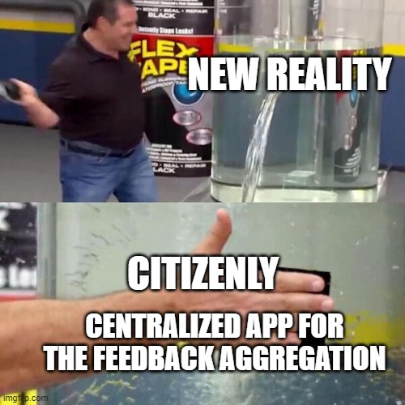
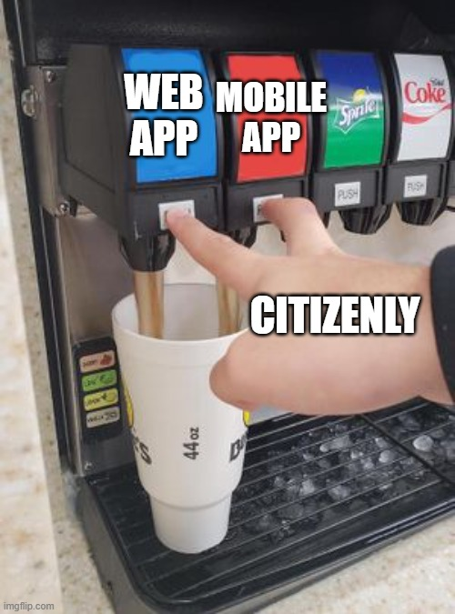
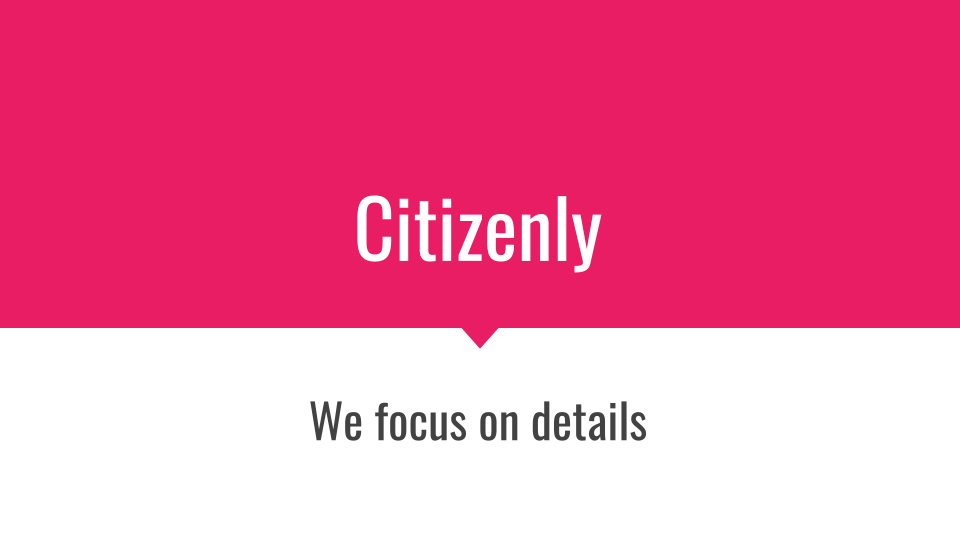

# Hacknarok 2022
The following repository is the result of the work for the Hacknarok 2022 Hackathon,
that took place on 2-3.04.2022. Members of the team **Waleczne Kaszkiety**:
Tymoteusz Ciesielski, Robert Kozik and Kamil Szczepanek joined their forces to face the common problem.
The subject was "New Reality". As a result, Citizenly app was conceived.

# Citizenly
Centralized platform for gathering the feedback.

1. Goal - centralized application for gathering the feedback.
2. Target groups 
- Users of the public and private institutions - schools, malls, restaurants.
- Owners of the institutions
- Maintainer of the institutions - cleaners, gardeners etc.

# Citizenly meme section

# Final presentation (in Polish)

.png)
.png)
.png)
.png)
.png)
.png)
.png)
.png)
.png)
.png)
.png)

*Readme written by Tymoteusz Ciesielski* \
03-04-2022