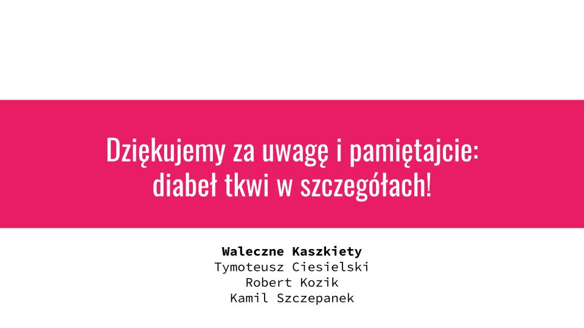

# Citizenly
Centralized platform for gathering the feedback.

1. Goal - centralized application for gathering the feedback.
2. Target groups 
- Users of the public and private institutions - schools, malls, restaurants.
- Owners of the institutions
- Maintainer of the institutions - cleaners, gardeners etc.

# Final presentation (in Polish)

*Readme written by Tymoteusz Ciesielski* \
03-04-2022